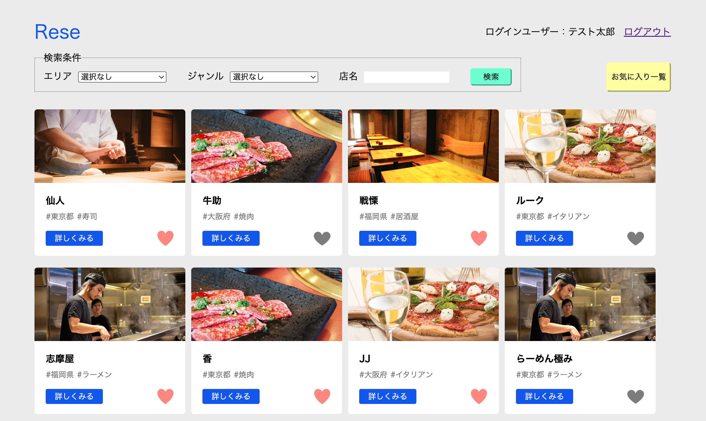
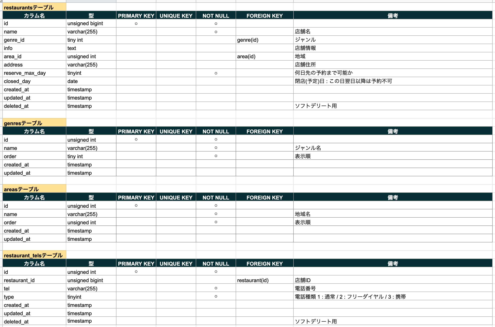
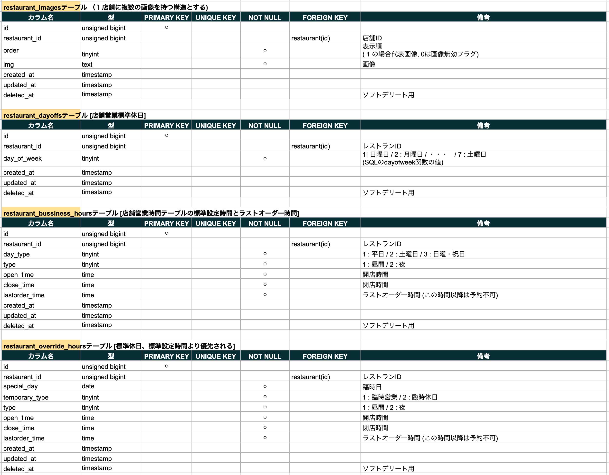
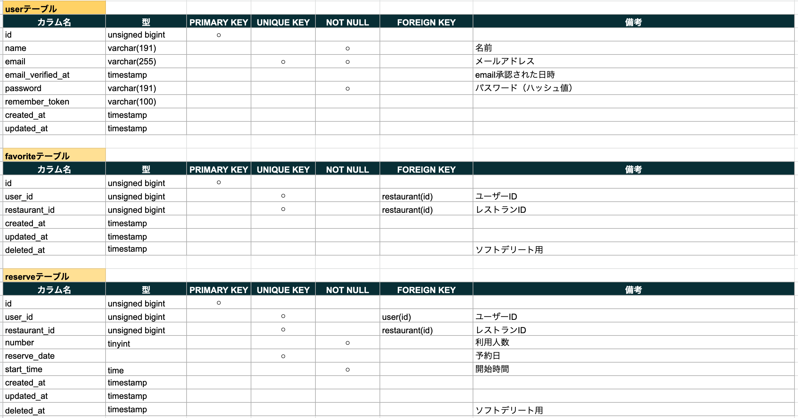
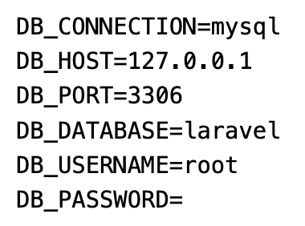
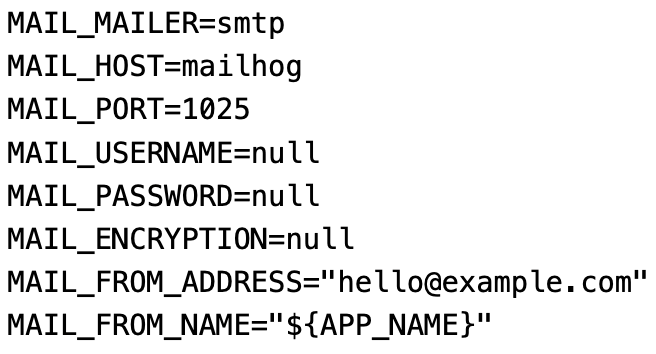
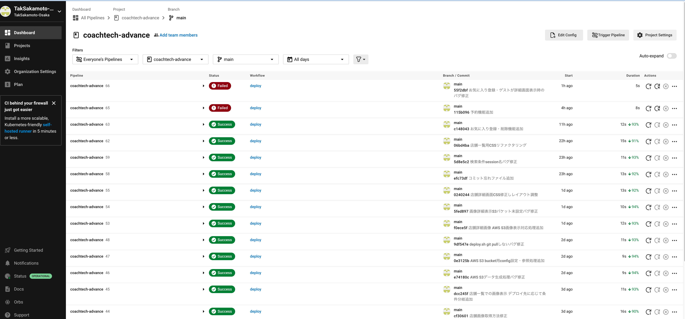

# coachtech-advance課題 飲食店予約サイト Rese(リーズ)
サイト内に登録されている飲食店の予約と管理ができるサイト


## 作成した目的
coachtech-advanceターム課題

## アプリケーションURL
### Heroku
http://warm-crag-29681.herokuapp.com

### AWS
http://aws-sakamoto-test.work
(サーバー自体は構築しているのですが、11月21(月)の夜からDNSエラーがでるようになり正常に表示できません。)

### ローカル環境
http://127.0.0.0.1:[ポート番号]

## リポジトリ
https://github.com/TakSakamoto-Osaka/coachtech-advance

## 機能一覧
- メール認証を用いた新規ユーザー登録
- パスワードリセット機能
- ログイン機能
- レストラン検索機能
- レストランお気に入り登録機能
- レストラン予約機能
- レストラン予約削除機能

## 使用技術(実行環境)
- Laravel 9.40.1

## テーブル設計
(設計当初は店舗の休日を設定しようと考えており、PHPのコードではmigration,seedまで行っているが、機能処理の実装までにはいたっておらず未使用)





## ER図


## ローカル環境構築
- リポジトリをクローンする
```sh
git clone https://github.com/TakSakamoto-Osaka/coachtech-advance
```

- ローカルリポジトリに移動
```sh
cd coachtech-advance
```

- composer update実行
```sh
composer update
```

- 環境ファイルの作成
ローカル環境(サーバー名が127.0.0.1で実行される場合)は .env.localを環境設定ファイルとして参照しています。
よって.env.localファイルの作成とDB接続, メール送信smtpの設定が必要です。
```sh
cp .env.example .env.local
vi .env.local
```

- .env.localのDB接続設定を実行環境に応じて編集



- .env.localのsmtpサーバー接続設定を実行環境に応じて編集


- DBマイグレーション
```sh
php artisan migrate:make --env=local
```

- DBデータシーティング
```sh
php artisan db:seed --env=local
```

- ローカルサーバー起動
```sh
php artisan serve
```

## 注記
- vue-routeのインストールとnpm run buildは不要
  Laravelが標準で用意しているViewは全てvueおよびtailwind CSSを使用しないようカスタム画面に置き換えているため、題記作業は必要ありません。

- 初期ログイン可能なアカウント
  - taro.test@test.com
  - hanako.test@test.com
  - jiro.test@test.com
  
  パスワードは全て 12345678 です。

- Circle CIによるデプロイ自動化


Circle CIの設定は ./circleci を参照してください

